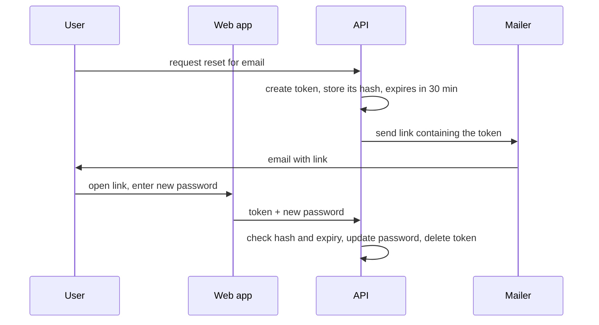

# Examples

Each example shows one behavior. Copy the behavior, not the wording, the domain, or the length.

## Put the missing context on the page

A pull request description written from inside the session:

> Fixes the flaky test from last week by moving the lock. Also bumped the timeout since 30s wasn't enough.

The reader doesn't know which test, why it was flaky, which lock, or why 30 seconds stopped being enough. Rewritten for a reviewer who hasn't seen the session:

> The `checkout_concurrency` test failed about one run in ten, because two workers could both read a sailing's seat count before either one wrote it. This change takes the row lock before the read (`src/capacity.ts:41`), so the second worker waits for the first. The test timeout goes from 30 to 60 seconds, because waiting on the lock made the slowest CI runs take up to 45 seconds.

## Give the example before the rule

An explanation that starts from the abstraction:

> The limiter uses a sliding-window counter keyed by API key and minute, summing the current bucket and the time-weighted previous bucket.

A reader has to rebuild the mechanism from the words. Starting from one concrete case:

> Suppose a key's limit is 600 requests per minute. At 12:00:45 it has made 200 requests since 12:00:00, and 500 in the minute before that. The limiter counts all 200 from this minute, plus the part of last minute that still falls inside the 60 seconds ending now. That is 15 of last minute's 60 seconds, so a quarter of its 500 requests, or 125. The total is 325, which is under 600, so the request goes through.
>
> In general, the limiter adds the current minute's count to the previous minute's count, weighted by how much of the previous minute is still inside the window.

## Draw the flow before describing it

A flow described only in prose:

> When a user asks for a reset, the API creates a token, stores its hash with a 30-minute expiry, and has the mailer send a link; when the user opens the link, the web app posts the token and new password to the API, which checks the hash and expiry, updates the password, and deletes the token.

The reader has to hold five actors and their order in their head. With a diagram first:

> The API never stores the token itself, only its hash, so a leaked database can't be used to reset passwords. A token works once and for 30 minutes.

The prose after the diagram adds only what the diagram can't show: the reasons.
